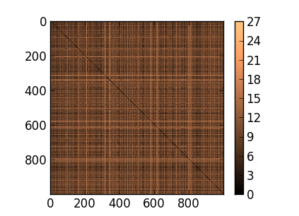
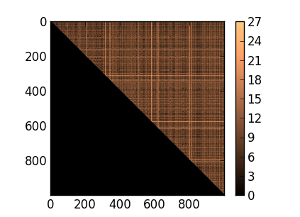

# Example 1: Comparison of Domain Names

  This example deals with the comparison of domain names.  The example shows
  how Harry can be used to find similar domain names given a target name,
  such as google.com

## Requirements and Files

 To run this example, you need a working installation of `python` and the
  python package `numpy`, which both are available with many operating
  system distributions.  Alternatively, you can download the free scientific
  python distribution [Anaconda](http://continuum.io/downloads) that is
  available for Linux, MacOS X and Windows.

  All files needed for the example are provided in this directory.  The
  domain names are listed in the file [`alexa1000.txt`](alexa1000.txt) and
  have been retrieved form the Alexa site ranking.  Moreover, a small python
  script for determining the most similar names is given in
  [`most_similar.py`](most_similar.py).

## Computing a Distance Matrix

  We start this example by computing a distance matrix. In particular, we
  calculate all pairwise distances between the 1000 domain names given in
  the file [`alexa1000.txt`](alexa1000.txt).  As distance function for this
  task, we pick the [Levenshtein
  distance](http://en.wikipedia.org/wiki/Levenshtein_distance), which tells
  us how many edit operations (insert, delete, substitute) would be
  necessary to convert one domain name into another.  This task can be
  easily carried out using Harry as follows:

      harry -v -d '' -m levenshtein alexa1000.txt distances.txt

  Note that the option `-d ''` tells Harry to compare the individual
  characters of the domain names instead of words separated by some
  delimiter characters.  The option `-m levenshtein` selects the Levenshtein
  distance.  You can see a list of all available similarity measures by
  running the command `harry -M`.

## Analyzing the Distances

  Once Harry has computed the distances, we switch to python. The following
  python code is available in the file [`most_similar.py`](most_similar.py). 
  First, we import the `sys` and `numpy` packages.

      import sys
      from numpy import *

  By default Harry stores the distance matrix in a text file. As the
  distances are symmetric, only the upper triangle of the matrix is written
  to the file.  Often, however, it is easier to operate with the full matrix
  and thus we use some `numpy` functions to restore the matrix.

      D = genfromtxt(sys.argv[1], delimiter=',')
      D[isnan(D)] = 0
      D = D.T + D

  
  

  The following two figures illustrate how the distance matrix is
  reconstructed.  The figures have been generated using the function
  `imshow` of the python package `matplotlib` that is often installed in
  combination with `numpy`.

  Once the matrix is restored we can sort its rows. Each row contains the
  distances from one domain name to all others.  By sorting the elements of
  a row, we can find all names that are similar to the domain name
  associated with the row.  In `numpy` we can do this as follows:

      j = argsort(D)

  The variable `j` does not store the sorted values but instead the indices
  of the sorted values.  That is, the element `j[i,k]` points to the _k_-th
  most similar name of the _i_-th domain name.  As each domain name is most
  similar to itself (_k=0_), we start our analysis at index 1 of each row. 
  We load the names and then print the most similar names for the first 5
  entries:

      N = array(open('alexa1000.txt').read().splitlines())
      for i in range(5):
          print '%s:\t%s' % (N[i], N[j[i, 1:4]])

  The output of the small python script should look as follows and indicate
  similar names.  Note that the script correctly identified the different
  versions of Google as well as sites somewhat similar to Youtube ;)

      google.com:	['google.ca' 'google.no' 'google.cl']
      facebook.com:	['facenama.com' 'taboola.com' 'fool.com']
      youtube.com:	['porntube.com' 'xtube.com' 'youku.com']
      yahoo.com:	['badoo.com' 'ehow.com' 'zanox.com']
      baidu.com:	['bing.com' 'aili.com' 'badoo.com']</pre>

## More Distances

  To get a feeling for the different distances for strings supported by
  Harry, simply run the example with other distance functions.  For example,
  you can use the [Jaro-Winkler
  distance](http://en.wikipedia.org/wiki/Jaro-Winkler_distance) that
  emphasizes similarities at the beginning of strings.

      harry -v -d '' -m jarowinkler alexa1000.txt distances.txt

   Alternatively, you can also experiment with the [normalized compression
  distance](http://en.wikipedia.org/wiki/Normalized_compression_distance)
  that takes a different route to assessing the similarity of strings.

      harry -v -d '' -m compression alexa1000.txt distances.txt
